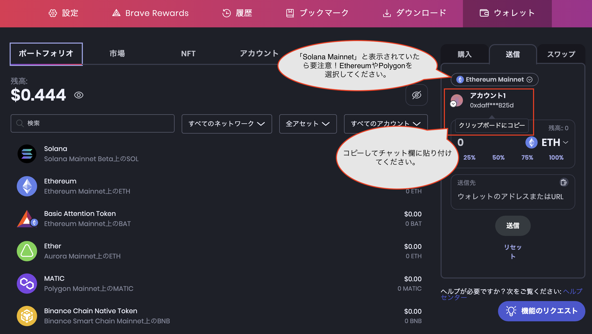
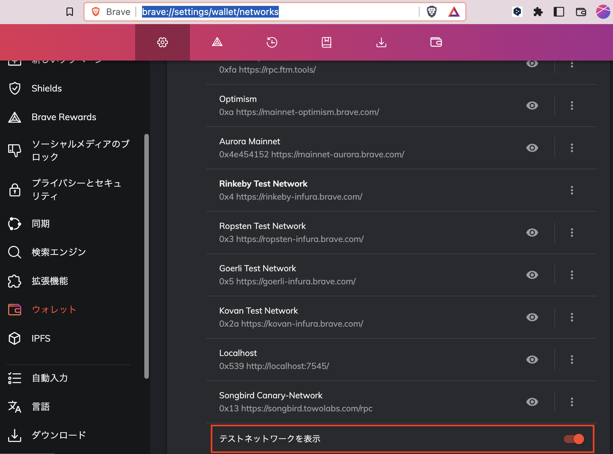
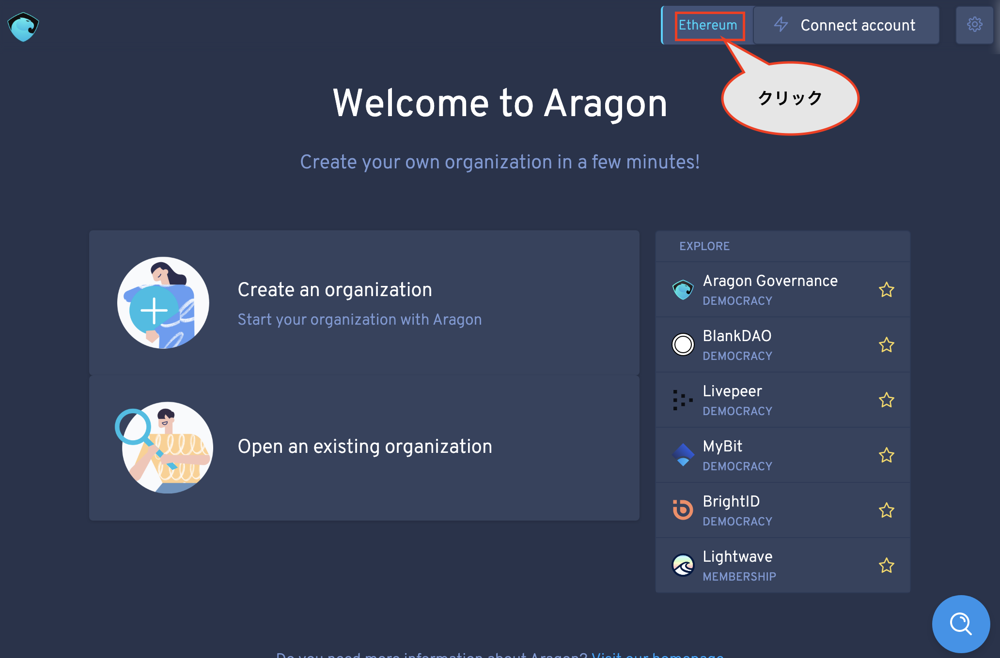
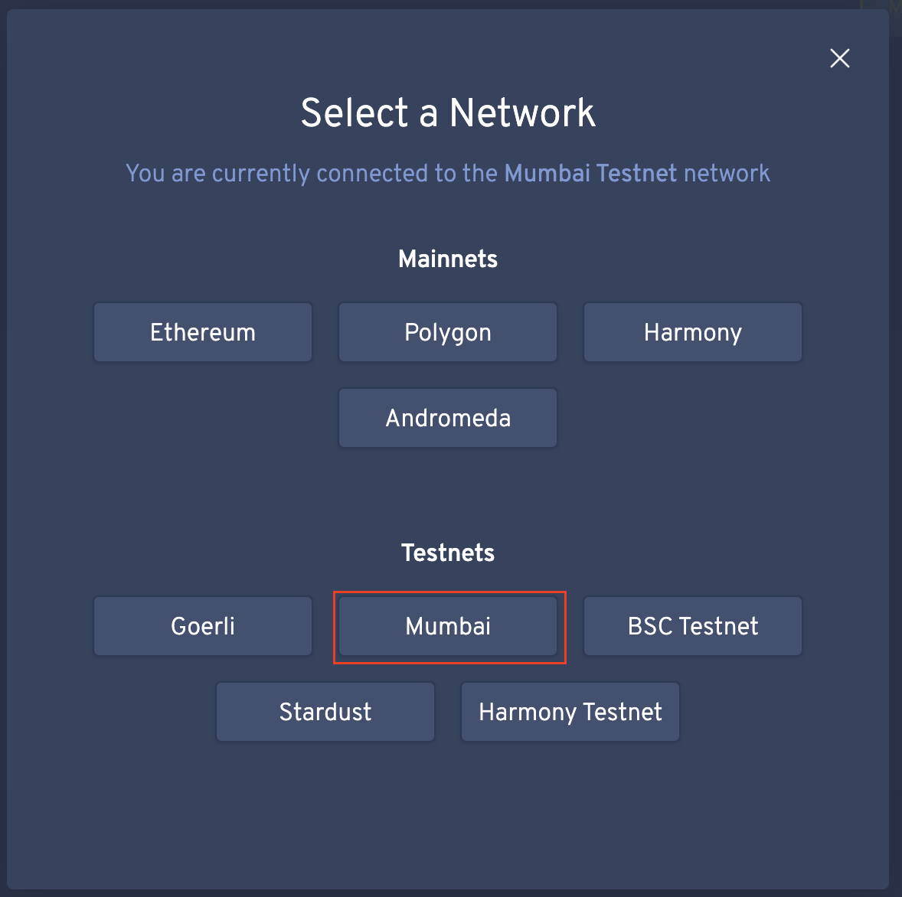
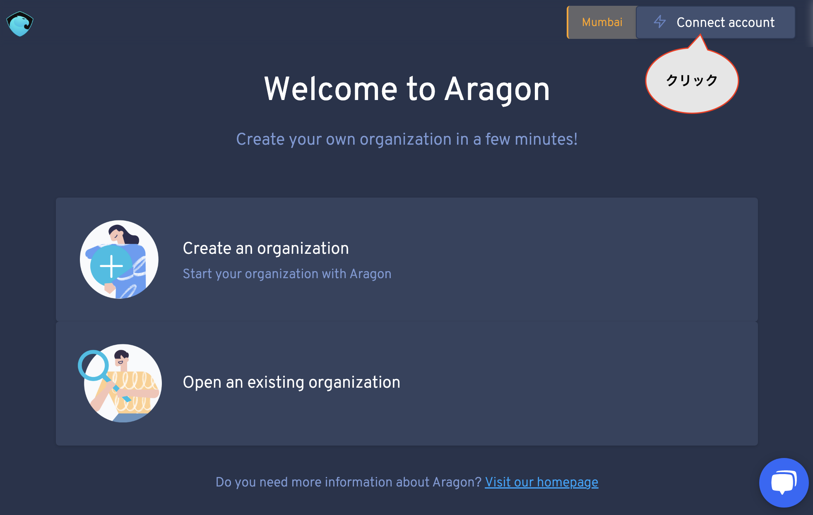
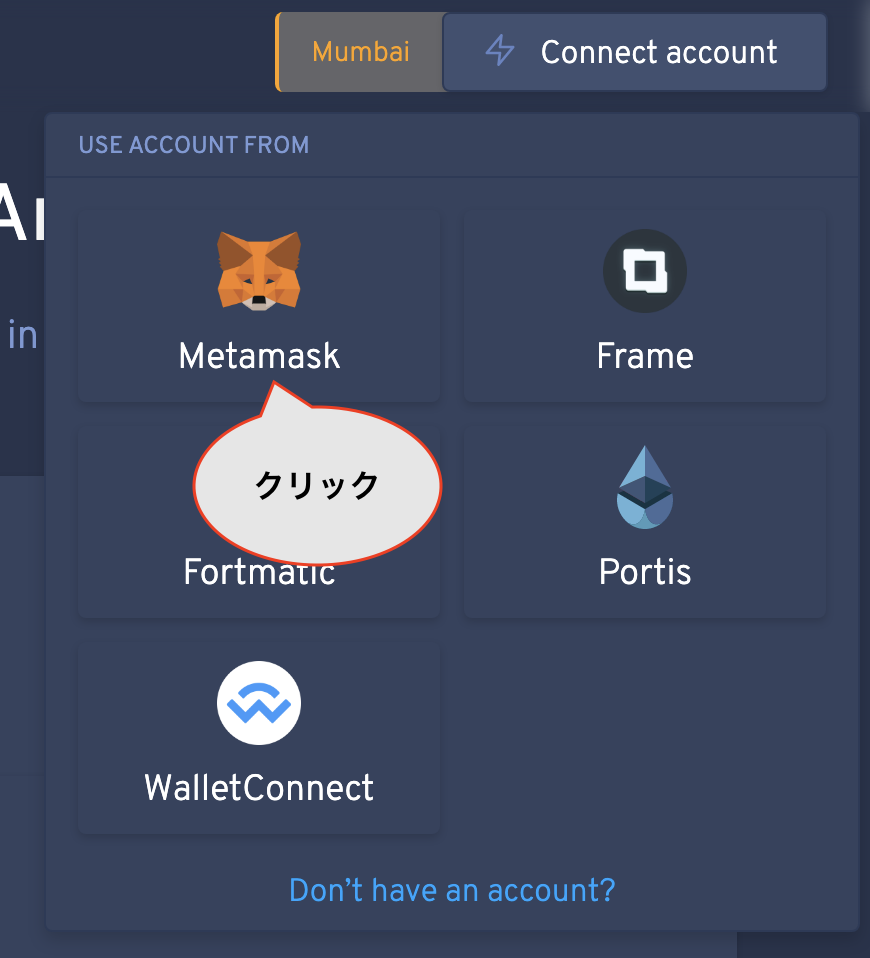
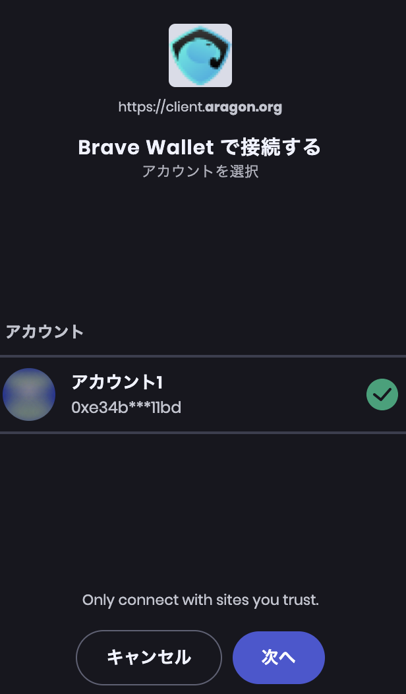
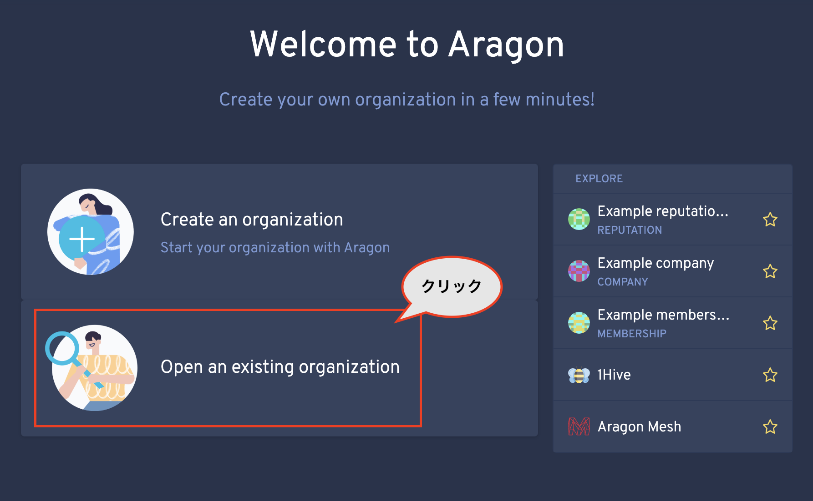
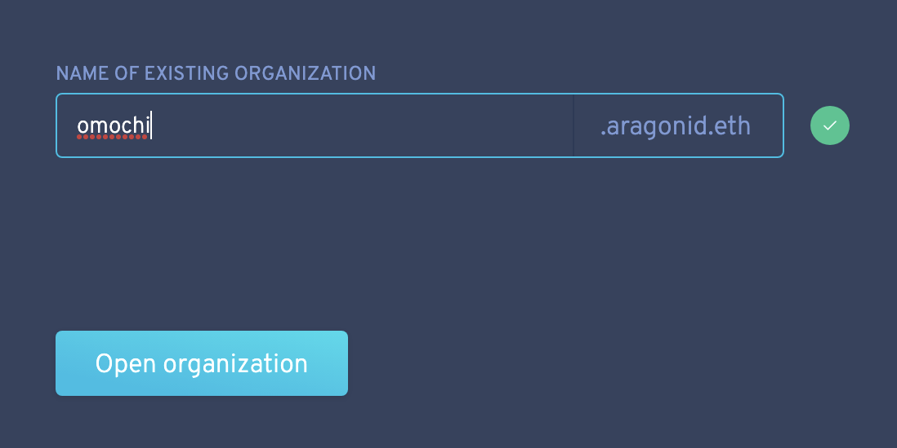
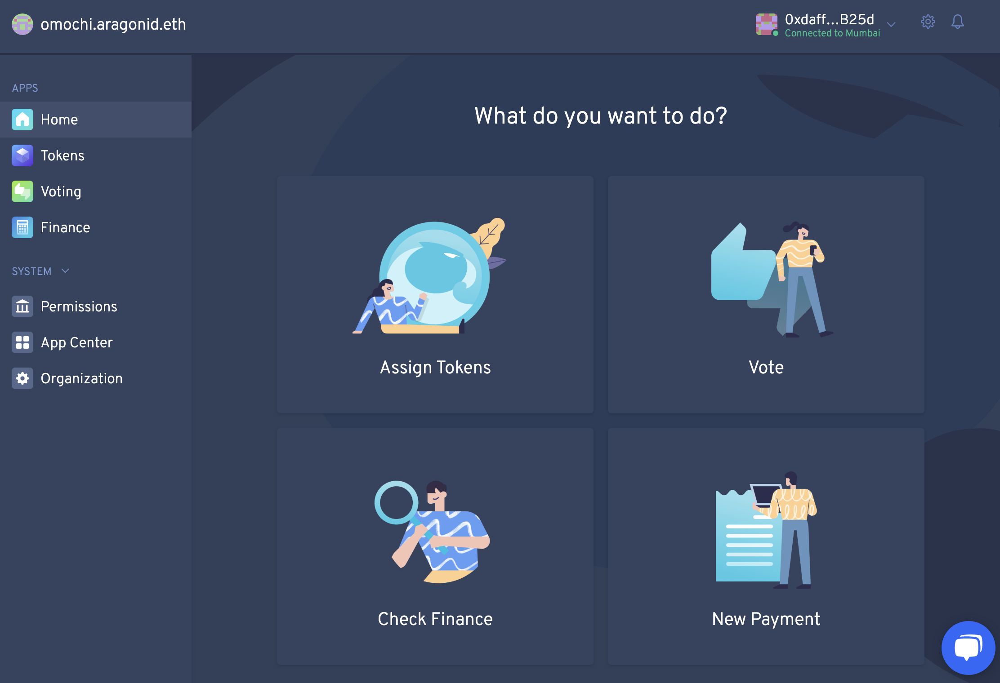

# OmochiDAOへの参加方法

## ウォレットの準備 
まず、Braveをインストールしてください。

[https://brave.com/download](https://brave.com/download)

次に、こちらのヘルプページの手順でBrave Walletを作成してください。

[https://support.brave.com/hc/en-us/articles/4413909784205](https://support.brave.com/hc/en-us/articles/4413909784205)

【勉強会参加者の方へ】ウォレットを作成したら、ウォレットアドレスをBrave Talkのチャット欄に投稿してください。ハンズオンで必要となるトークン(eth, mch)をお送りします。ちなみにテストネットなので資産価値はゼロです。ご安心ください。

## Brave Walletの設定
Omochi DAOはEthereumのテストネットであるRinkebyを使用するため、設定の確認が必要です。

Braveのアドレスバーに

brave://settings/wallet/networks

と入力し、設定画面を表示させます。画面をしたに移動し、「テストネットワークを表示」を有効にしてください。

## Aragonにアクセス

[https://client.aragon.org/](https://client.aragon.org/)にアクセスします。
まず、ネットワーク設定をRinkebyにセットします。

次にウォレット接続を行います。

それではDAOに入りましょう！

