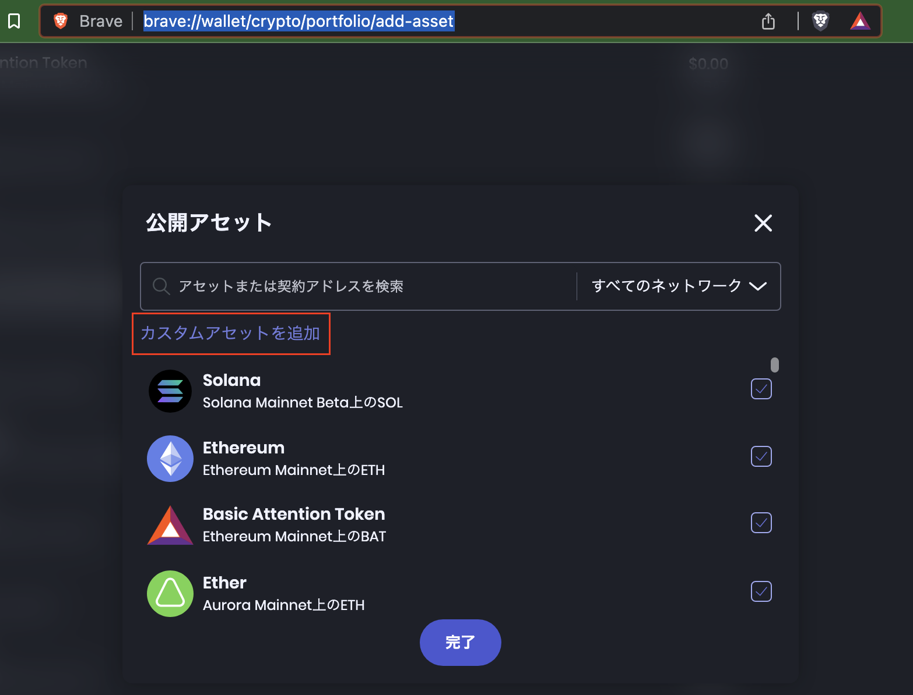
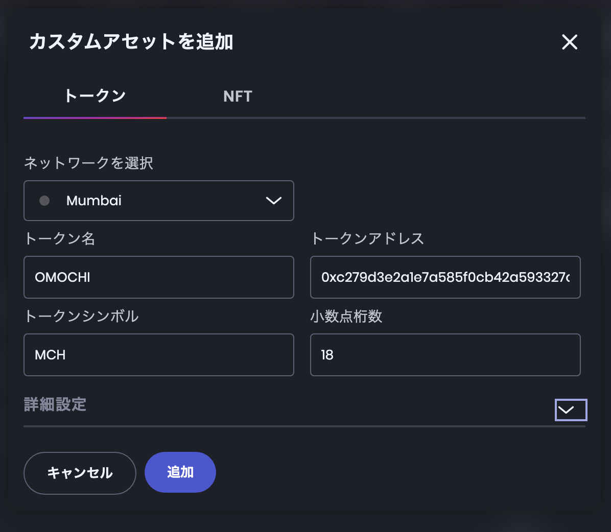
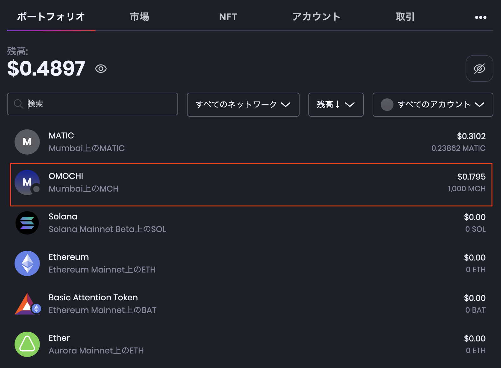
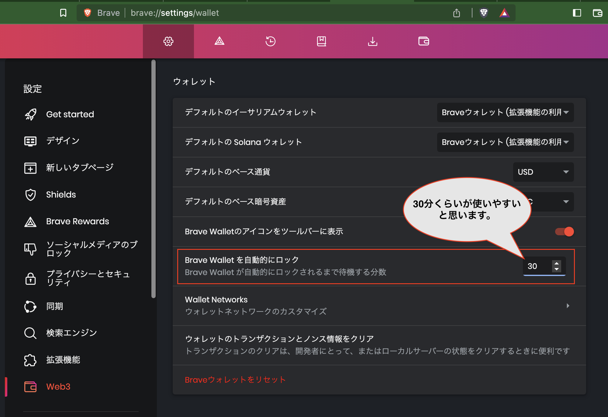
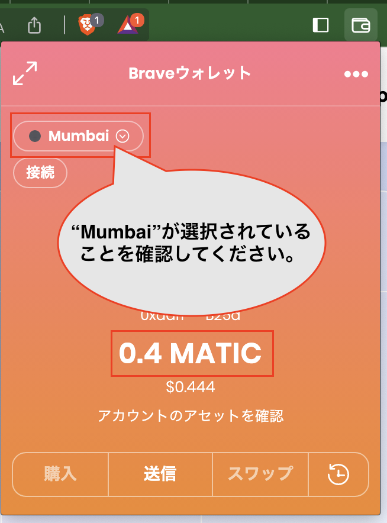
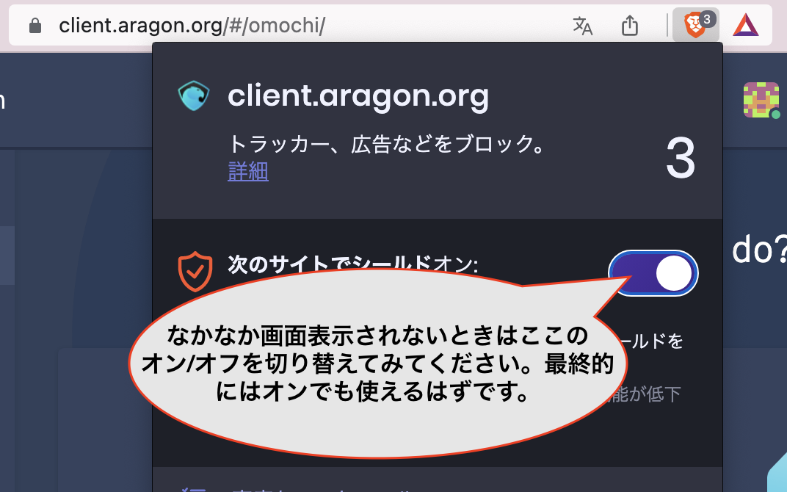

# OmochiDAOへの参加方法

## ウォレットの準備 
まず、デスクトップ端末にBraveをインストールしてください。

[https://brave.com/download](https://brave.com/download)

次に、こちらのヘルプページの手順でBrave Walletを作成してください。

[https://support.brave.com/hc/en-us/articles/4413909784205](https://support.brave.com/hc/en-us/articles/4413909784205)

【勉強会参加者の方へ】ウォレットを作成したら、ウォレットアドレスをBrave Talkのチャット欄に投稿してください。ハンズオンで必要となるトークン(mch)をお送りします。ちなみにテストネットなので資産価値はゼロです。ご安心ください。

## Brave Walletの設定(Mumbaiネットワークの追加)
Omochi DAOはPolygonのテストネットであるMumbaiを使用するため、設定の確認が必要です。

Braveのアドレスバーに

brave://settings/wallet/networks

と入力し、設定画面を表示させます。「Ethereumネットワーク」の右の［追加］を押下してください。

「ネットワークを検索」で "mumbai" と入力し、表示された項目を選択します。

必要な設定が自動入力されますので、画面を下にスクロールし、［送信］を押下します。

## Brave Walletの設定(MCHトークンの表示設定)
勉強会で使用するOMOCHI(MCH)トークンは、この勉強会でしか使用されないため、ウォレットに表示させるための設定が必要です。

Braveのアドレスバーに

brave://wallet/crypto/portfolio/add-asset

と入力し、「カスタムアセットを追加」をクリックします。

それぞれの項目は以下の通り設定します。

■ネットワークを選択  
Mumbai

■トークン名  
OMOCHI

■トークンアドレス  
0xC279D3E2A1E7A585F0Cb42A593327cEd909FdA86

■トークンシンボル  
MCH

小数点桁数  
18

［追加］ボタンを押下すると、OMOCHIトークンが表示されます！

## Brave Walletの設定(ロックされるまでの時間)

そのほか、

brave://settings/wallet

で、ウォレットがロックされるまでの時間を30分程度に設定することを推奨します。

## ガス代で使用するmaticトークンの取得
[https://faucet.polygon.technology/](https://faucet.polygon.technology/)にアクセスし、ウォレットアドレスを入力して［Submit］を押下してください。

確認画面が表示されたら［Confirm］を押下します。

この画面が表示されたら作業は完了です。

1,2分経つと、ウォレットにmaticが送金されたことが確認できます。おそらく0.2maticが振り込まれたと思います。ちなみに、何度もmaticをもらおうとするとサイトでエラーになるのでご注意ください。

## Aragonにアクセス

[https://client.aragon.org/](https://client.aragon.org/)にアクセスします。
まず、ネットワーク設定をMumbaiにセットします。

次にウォレット接続を行います。

それではDAOに入りましょう！

"Loading App" の表示がなかなか消えないときは、Brave Shieldsを一度無効にしてみてください。画面が表示されたら有効に戻して問題ありません。
