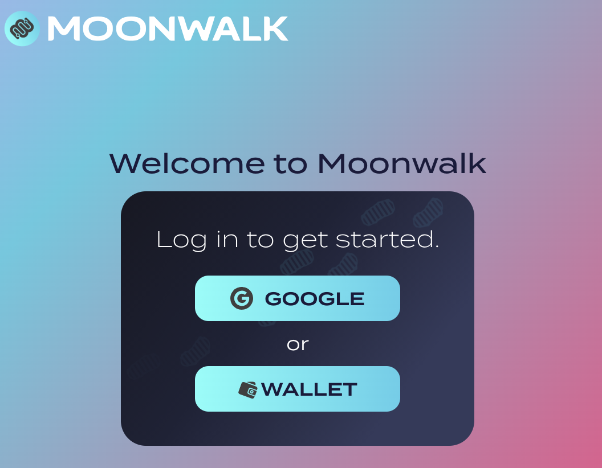
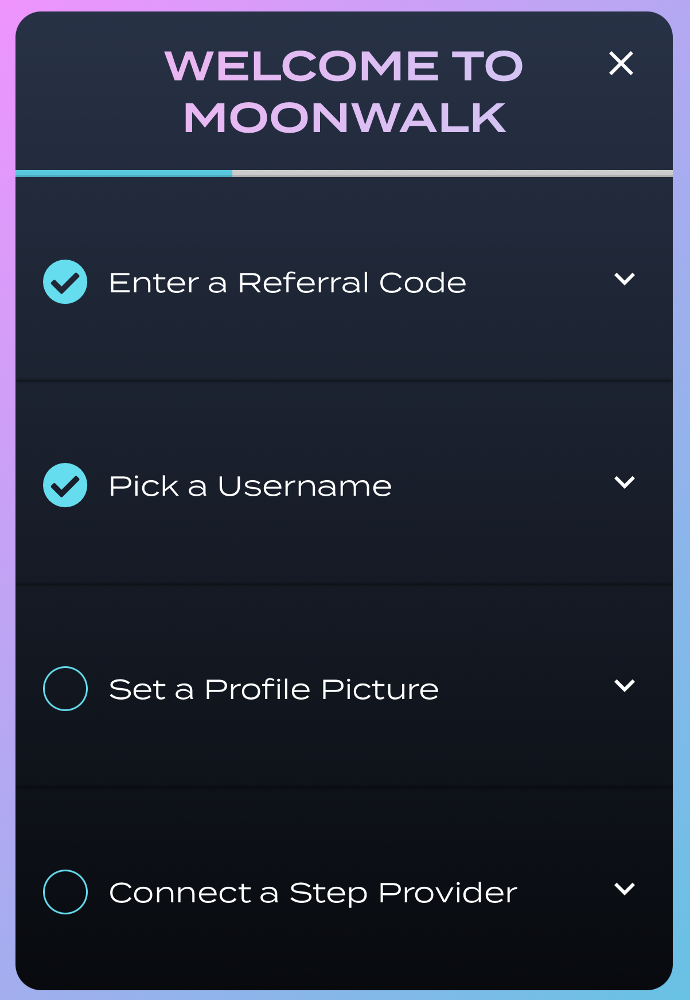
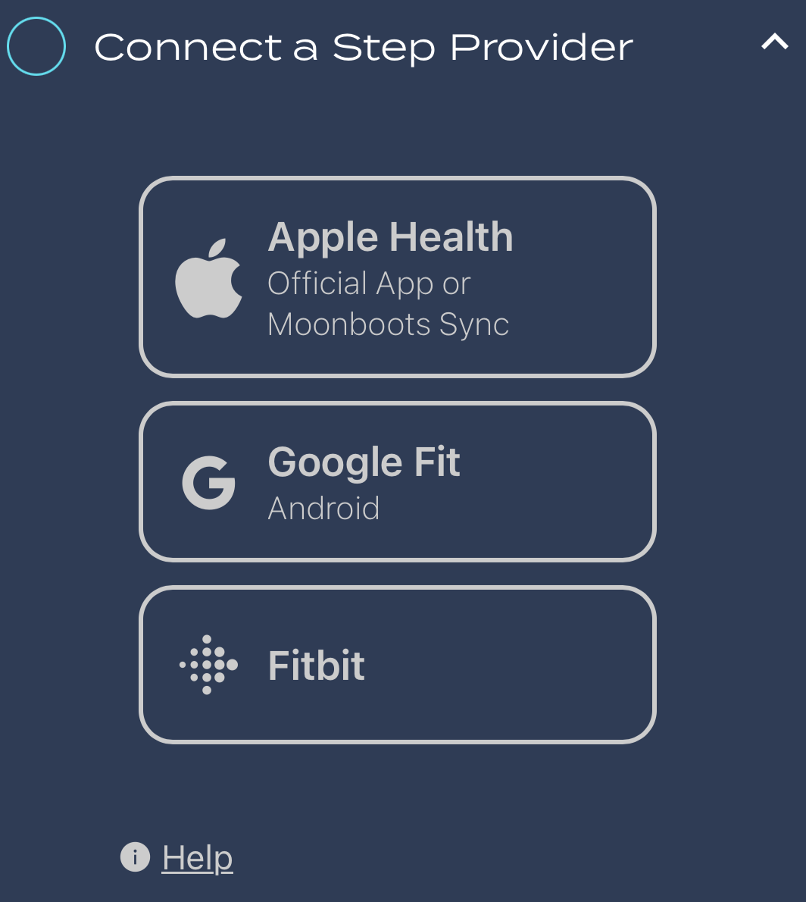
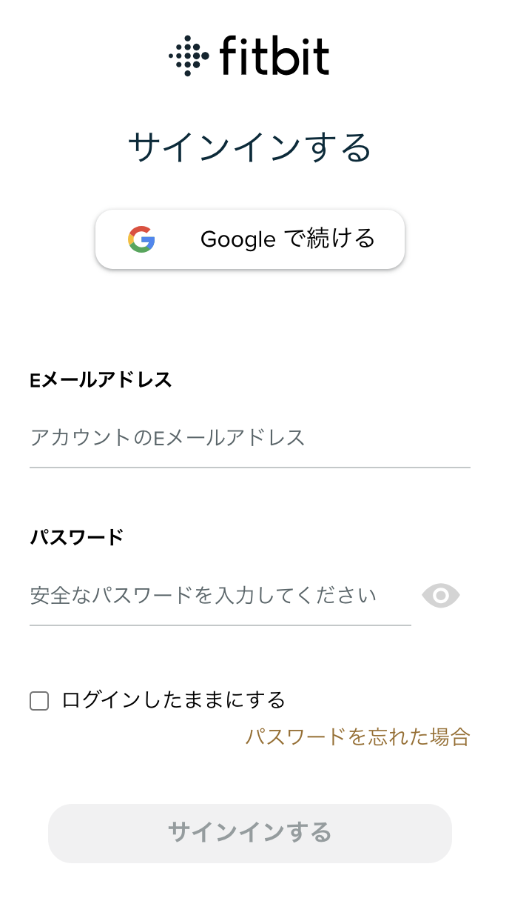
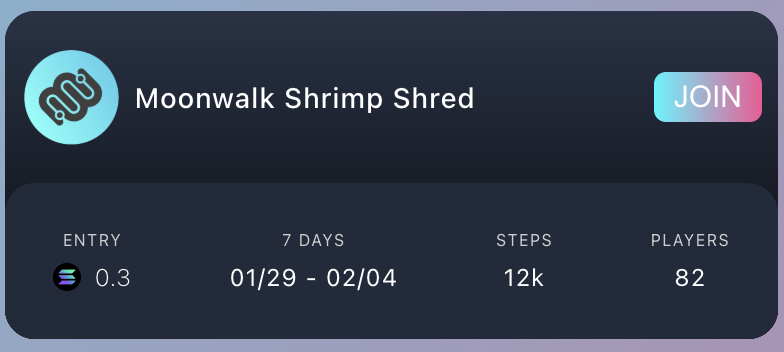
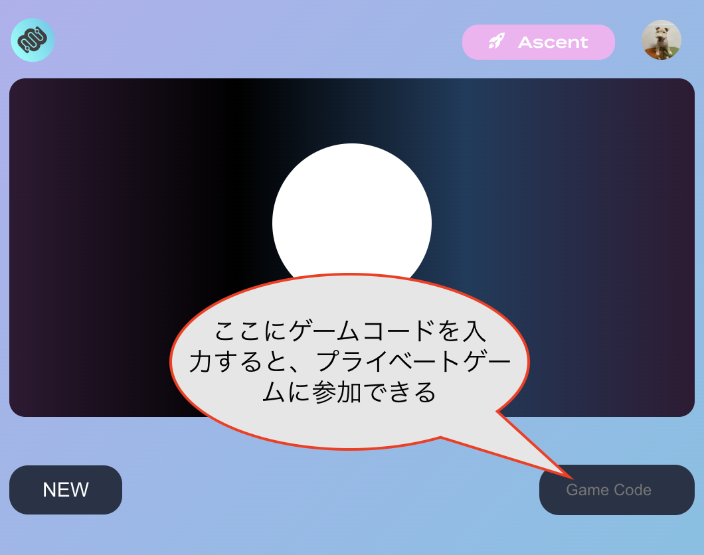
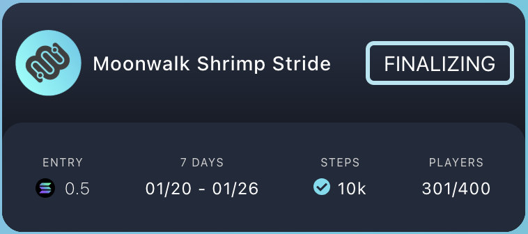
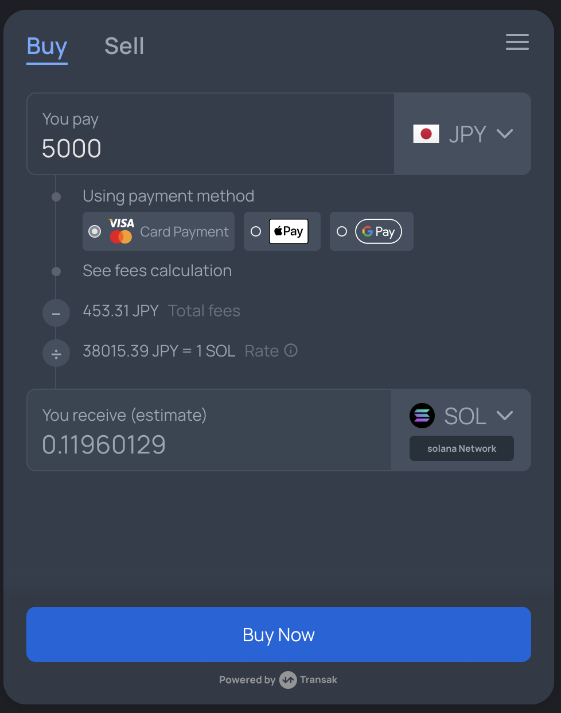

moonwalkの紹介！！

毎日歩いていると何かいいことがあるmoonwalkのまとめ

Index
- [moonwalkとは](#moonwalkとは)
  - [moonwalkを遊ぶときの流れ](#moonwalkを遊ぶときの流れ)
    - [ログインする](#ログインする)
      - [初めてログインしたとき](#初めてログインしたとき)
      - [ステップ・プロバイダーの設定](#ステッププロバイダーの設定)
    - [沢山あるmoonwalkゲームの中から自分が参加するゲームを決める](#沢山あるmoonwalkゲームの中から自分が参加するゲームを決める)
      - [プライベートゲームに参加する場合](#プライベートゲームに参加する場合)
    - [開催期間になったら毎日歩く](#開催期間になったら毎日歩く)
    - [開催期間終了後](#開催期間終了後)
  - [moonwalkFAQ](#moonwalkfaq)
    - [Solanaを使ったことがなくてガス代がありません](#solanaを使ったことがなくてガス代がありません)
      - [知り合いにお願いして少額のSOLを送ってもらう](#知り合いにお願いして少額のsolを送ってもらう)
      - [国内取引所でSOLを購入しmoonwalkで使用するウォレットに送金する](#国内取引所でsolを購入しmoonwalkで使用するウォレットに送金する)
      - [オンランプ・サービスでSOLを購入して直接ウォレットに入金する](#オンランプサービスでsolを購入して直接ウォレットに入金する)
      - [国内取引所にせよ、オンランプにせよ、常に意識しておくべきこと](#国内取引所にせよオンランプにせよ常に意識しておくべきこと)
    - [どれくらいのSOLがあればmoonwalkに参加できますか](#どれくらいのsolがあればmoonwalkに参加できますか)
    - [moonwalkは儲かるんですか?](#moonwalkは儲かるんですか)
    - [参加者はどんなモチベーションでmoonwalkに参加しているのですか](#参加者はどんなモチベーションでmoonwalkに参加しているのですか)

# moonwalkとは

moonwalkはブロックチェーンを活用したフィットネスアプリです。まず一連の流れを見てみましょう。

## moonwalkを遊ぶときの流れ

### ログインする

[app.moonwalk.fit](https://app.moonwalk.fit)にアクセスすると、まずログイン方法が二つ提示されています。

* GOOGLE：このログインオプションを選択すると、[TipLink](https://tiplink.io/)というGoogleアカウントを用いてSolanaアカウントを作成/管理できるサービスを使用してmoonwalkにログインします。Solanaウォレットを持っていない方はこのGoogleオプションを使えば、面倒くさいウォレット作成をすっ飛ばしして簡単にログインすることができます。
* WALLET：Brave Wallet, Phantom, Backpack等のセルフカストディ型のSolanaウォレットを使用してmoonwalkにログインします。

#### 初めてログインしたとき

はじめてmoonwalkにログインした時はいくつか初期設定が必要になります。

* リファラルコードの入力：ここは必須ではないので入力しなくて構いません。もしも何か入力したい場合は私のリファラルコード(7jdkfxh4)を入力してください。(私にどんないいことがあるのかはよくわかりません)
* ユーザー名の設定：現状アルファベットと数字しか杖かないみたいです。たぶん必須項目。あとから変更可能。
* プロフィール写真の設定：必須ではないです。あとから変更可能。
* ステップ・プロバイダーの設定：どのように日々の歩数をmoonwalkに反映するか、という設定です。

#### ステップ・プロバイダーの設定

* Apple Health：iPhoneユーザーの方はこれを選択します。少しややこしいのですが、iOSのmoonwalkアプリは2種類あります。
  * [Moonwalk Fitnessアプリ](https://apps.apple.com/ja/app/moonwalk-fitness/id6692608601)：すんません、まだ使ったことないのですが、ログイン時と同じウォレット or Googleアカウントでログインして使用します。
  * [Moonboots Sync](https://apps.apple.com/ja/app/moonboots-sync/id6504540169)：上記のMoonwalkアプリよりもシンプルな機能しかなく、基本的にはiOS標準搭載の[ヘルスケアアプリ](https://apps.apple.com/jp/app/apple-%E3%83%98%E3%83%AB%E3%82%B9%E3%82%B1%E3%82%A2/id1242545199)から歩数データをmoonwalkに反映させるだけです。これは一日に何度か開いて、サーバに歩数を反映させる必要があります。
* [Google Fit](https://www.google.com/intl/ja_jp/fit/)：Androidユーザーの方はこれを選択します。設定時にGoogle Fitで使用しているGoogleアカウントでログインを行なって歩数のリンクが開始されるようです。
* [FitBit](https://play.google.com/store/apps/details?id=com.fitbit.FitbitMobile&hl=ja)：というフィットネスアプリを使用している方は、これをmoonwalkと同期させることができるようです。

### 沢山あるmoonwalkゲームの中から自分が参加するゲームを決める

moonwalkは開催されているゲームごとに参加条件/クリア条件が異なります。以下のゲームの場合、ゲームの参加条件/クリア条件はこのようになります。

* 参加料/デポジット：0.3sol（クリア条件を達成すると戻ってきます）
* ゲーム期間：1/29-2/4(7日間)
* クリア条件：上記ゲーム期間に毎日12,000歩歩く！
* 参加者数：82人

開催ゲームによって、参加料も期間もクリア条件も様々です。まずは無理のないところからはじめてみるのがいいと思います。参加するゲームが決まったら、[JOIN]ボタンを押しましょう。このとき、参加料/デポジット以外にブロックチェーンのガス代が必要になります。moonwalkはSolanaチェーンを使用しているため、ガス代にはSOLが必要です。少額で構わないのですが、残高がゼロSOLでは参加できませんのでご注意ください。(手持ちのSOLがない方向けに[FAQを後述しています](#Solanaを使ったことがなくてガス代がありません)。)

* 参加料は「えー、そんなにするの！」というくらい高いものから、無料のものまで様々です。参加料が無料のゲームはガス代はかかりますがその他のリスクはほぼありません！
* ゲーム期間も1-2日のものがあれば、一ヶ月くらいのものまであります。
* クリア条件は簡単なものだと3000歩くらい、きつめのもので15,000歩くらいでしょうか。流石に毎日欠かさず15,000歩歩くのは大変なので、無理がないところで参加しましょう。

#### プライベートゲームに参加する場合

moonwalkは3回以上パブリックゲームに参加すると、仲間内でまったり楽しむためのプライベートゲームに参加できるようになります。このようなプライベートゲームに参加する場合は、ゲームコードを入力する必要があります。

### 開催期間になったら毎日歩く

クリア条件を達成すべく、とにかく沢山歩きましょう！歩く時は必ずスマートフォンかスマートウォッチをつけて、moonwalkに歩数がカウントされるようにしましょう。自分が滞在している地域において、深夜24時になるまでが一日です。仮にクリア条件が10,000歩であれば、23:59までに10,000歩歩かなければなりません。また、moonwalkに日々の歩数が反映されているか、確認しましょう。開催期間終了までなら当日以前の歩数も反映させることができます。開催期間が終わり、集計(ファイナライズ)が終わってしまうと手遅れになるので注意しましょう。

### 開催期間終了後

開催期間終了直後、1-3日くらい集計期間になります。集計が終わるのをとりあえず待ちます。集計が終わったら、参加料/デポジットを回収(claim)しましょう。スポンサー賞金が出ているときは、スポンサー賞金のclaimも忘れずに！

* 開催期間毎日クリア条件が達成できた場合、参加料/デポジットは全額返ってきます。
* 例えば開催期間5日間のゲームで、一日クリアできなかった日があった場合、参加料/デポジットは4/5返ってきます。(少しだけ減ることになります。)
* スポンサー賞金が設定されている場合、参加者でかつ前日クリア条件を達成した人たちで賞金を山分けするようになります。
* 参加料/デポジットが無料のゲームは、クリア条件を達成できなくても残高が減ってしまうリスクがありません！

集計中はこんな感じで "FINALIZING" と表示されます。

集計が終わると "CLAIM" という表示に変わるので、このCLAIMボタンを押してデポジットを回収します。(あとで画像追加)

また、スポンサー賞金はここからclaimします。(あとで画像追加)

## moonwalkFAQ

### Solanaを使ったことがなくてガス代がありません

ガス代とは、Blockchainを使うときに必ず必要になる手数料です。Solanaのガス代は割安とはいえ、多少のSOLは必ず必要になります。SOLを入手する方法を以下に紹介します。

#### 知り合いにお願いして少額のSOLを送ってもらう

いい人が見つかるといいですね。

#### 国内取引所でSOLを購入しmoonwalkで使用するウォレットに送金する

なぜかGMOコインのkyc(本人確認)が通らないので、あとで詳しく書きます。

基本的な流れは以下の通り。

1. 取引所に日本円を入金する
2. SOLを購入する
3. 取引所からSOLをmoonwalkで使うウォレットに送金する

SOLを扱っている国内取引所の例。

* [GMOコイン](https://coin.z.com/)
* [SBI VC トレード](https://www.sbivc.co.jp/)
* [BitTrade](https://www.bittrade.co.jp/)

他にもあると思いますが、意外とbitFlyerやCoincheckではSOLを扱っていないので注意。

#### オンランプ・サービスでSOLを購入して直接ウォレットに入金する

国内取引所との大きな違いは、国内取引所では「SOLを購入した時点では、取引所でアセットが管理されているので別途送金手続きが必要」であるのに対し、onlamp(オンランプ)を使うと「SOLを買った時点で自分のウォレットにSOLが送られてくる」というところです。こっちの方が手間がかかりません。ただし、オンランプサービスは全て海外の事業者によって提供されているので英語を読みながら操作を進めることになります。英語のサイトに慣れていない方は国内取引所を使った方が結果的に安心して手続きが進められるかもしれません。

以下はSOLを扱っているオンランプ事業者です。日本もサポート対象になっているようです。ちなみに私はTransakは使ったことがありますが、Topperは使ったことがありません。

* [Topper](https://app.topperpay.com/)
* [Transak](https://global.transak.com/)

ちなみにTransakの画面はこんな感じです。レートはその時々で変わります。

#### 国内取引所にせよ、オンランプにせよ、常に意識しておくべきこと

オンランプ事業者のTransakはフィッシング攻撃により[情報漏洩を起こした過去があります](https://coinpost.jp/?p=567597)。あらやだ、海外の事業所は怖い、信用できない... という程話は簡単ではなく、国内取引所においてもDMMビットコインから約482億円相当のBTCが不正流出し、顧客資産は保証されたものの結果的にDMMビットコインが廃業する、[という事件がありました](https://coinpost.jp/?p=577304)。どのようなサービスを使うにせよ、常にどこかにリスクがあることは覚えておきましょう。

### どれくらいのSOLがあればmoonwalkに参加できますか

参加料無料のゲームに参加するだけなら、0.01SOLもあれば十分です。ただし、国内取引所からウォレットに送金するときに「最低◯SOL以上」みたいな制限があって、少額送金はもしかしたらできないかもしれません。

### moonwalkは儲かるんですか?

あんまり儲かりません。むしろクリア条件を達成できなかったときはデポジットがどんどん減ってしまいます。

### 参加者はどんなモチベーションでmoonwalkに参加しているのですか

moonwalkはフィットネスアプリです。「この期間、毎日これだけ歩くぞ！」と、自分を追い込むためのものだと考えてみるのもいいかもしれません。実際、「もうすぐ日付が変わるけどあと1000歩足りない...」みたいなとき、部屋の中を無駄に行ったり来たりするような場合もあります。あとはコミュニティのツールとして、気の合う仲間と一緒にやるとなんとなくモチベーションが上がるかもしれませんよ！
