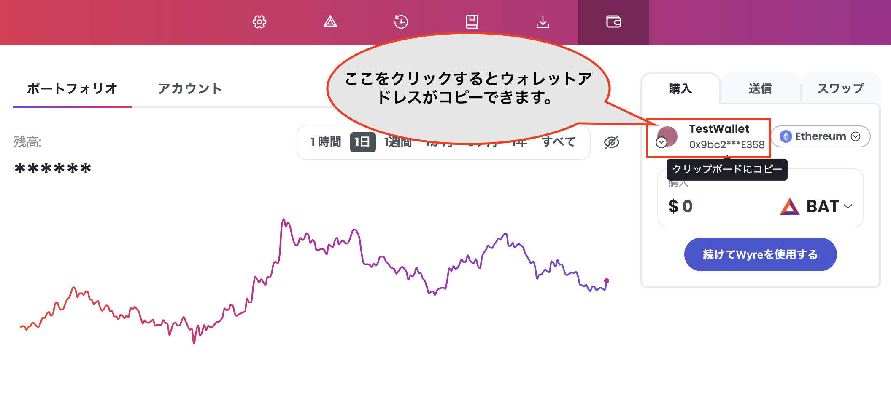
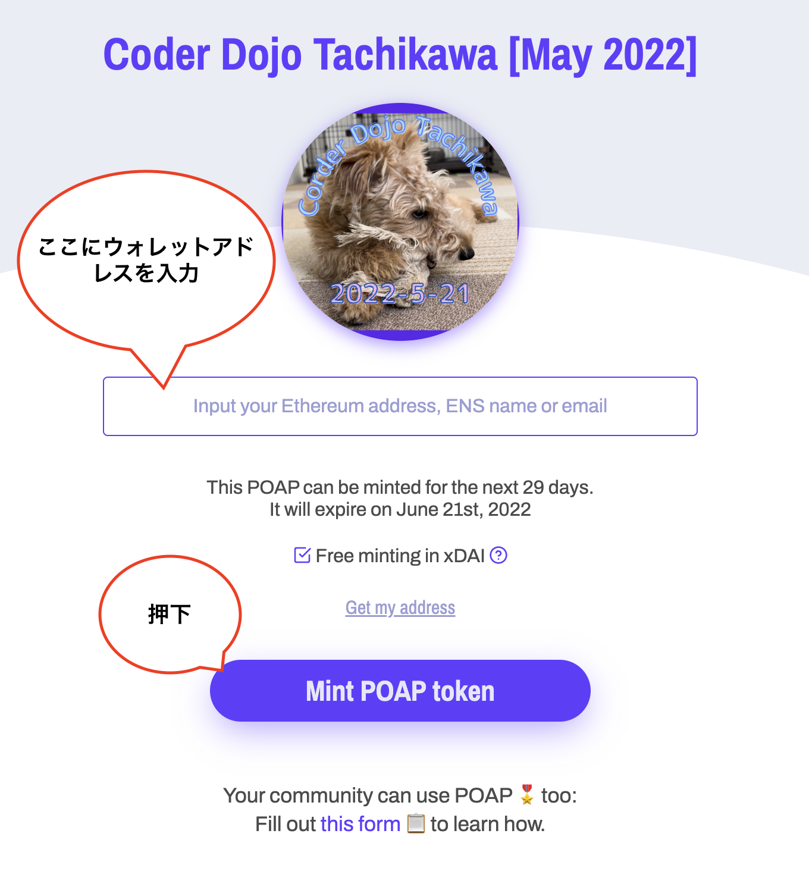
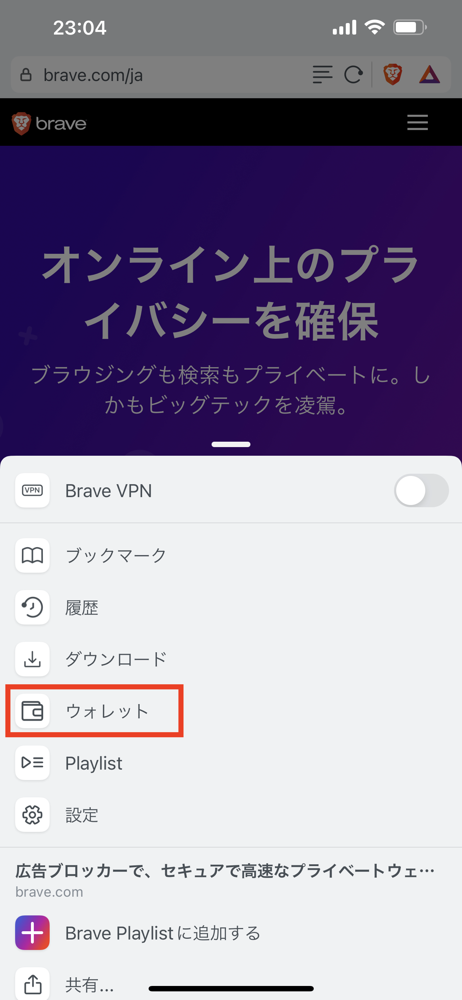
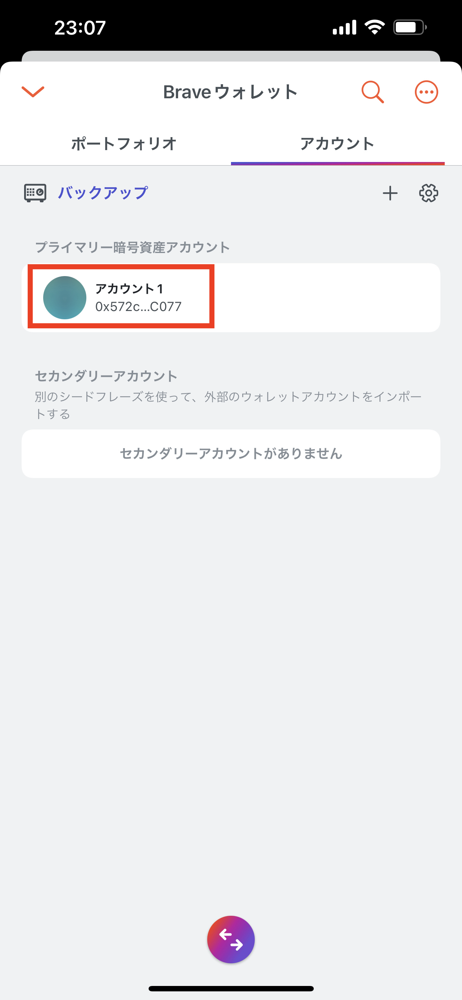
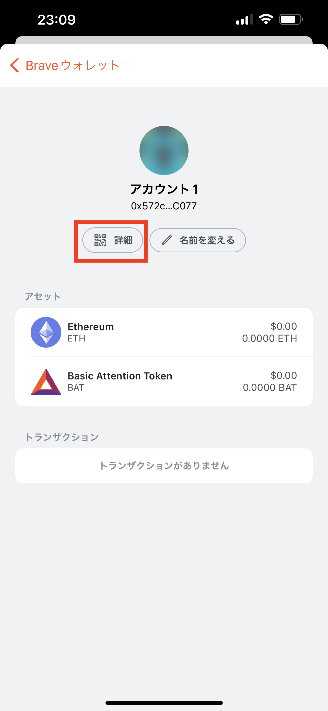
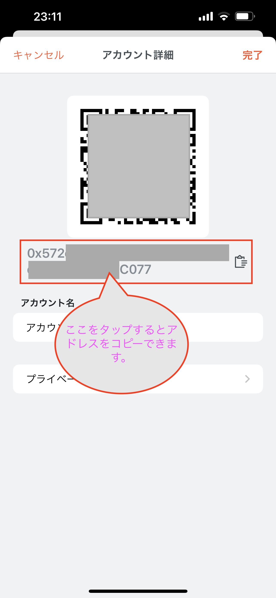
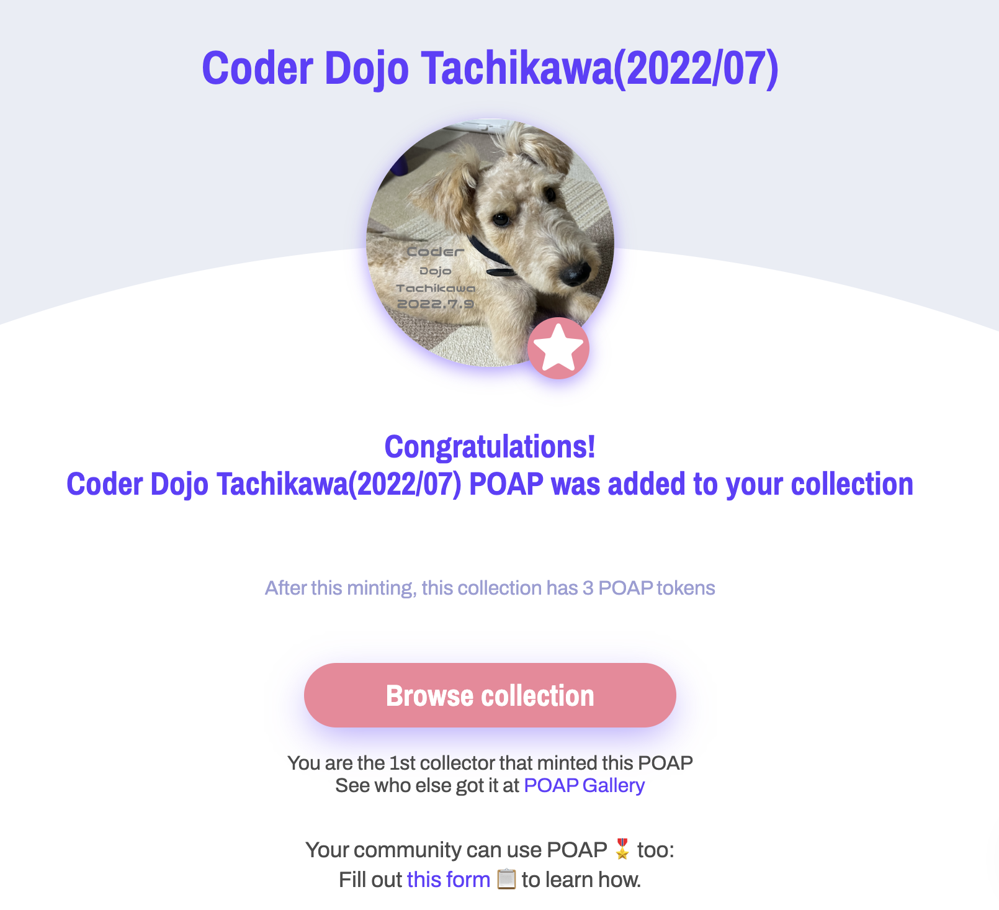

# POAP(NFT)の獲得方法

## ウォレットの準備 
まずPOAPを受け取るためのウォレットを準備します。ここではBrave Walletでのウォレット作成を説明します。 

まず、Braveをインストールしてください。

[https://brave.com/download](https://brave.com/download)

次に、こちらのヘルプページの手順でBrave Walletを作成してください。

[https://support.brave.com/hc/en-us/articles/4413909784205](https://support.brave.com/hc/en-us/articles/4413909784205)

Braveブラウザ及びBrave WalletはAndroid、iOSでも使用可能です。まずappSrore/PlayStoreでBraveをダウンロードし、同様の手順でBrave Walletを作成してください。

Brave Walletはこのような画面です。  

## POAPの取得
POAPを受け取るには以下の2通りの方法があります。

### POAP配布用のURLをもらう
POAPの管理者より、POAP配布用のURLを教えてもらい、受け取りページにアクセスする方法です。デスクトップでBrave Walletを利用している場合はこの方法が早いかもしれません。

### POAP配布ページへQRコードよりアクセスする。
POAP配布用のQRコードが準備されている場合、わざわざ「URLを教えてください」と管理者に伺う必要なくPOAP配布ページにアクセスすることができます。モバイルデバイスを利用している場合はこの方法が早いと思います。

URLにアクセスしたら、ウォレットアドレスを入力(コピペ)し、［Mint POAP token］を押下します。  

モバイル版のBrave Walletをご利用の場合は以下の手順でウォレットアドレスをコピーすることができます。

1. Brave Walletを表示します。  

2. 「アカウント」タブを選択します。  
3. 「プライマリー暗号資産アカウント」よりアカウントを選択します。  

4. 「詳細」を選択します。  

5. ウォレットアドレスをタップするとアドレスをコピーすることができます。  

［Mint POAP token］を押下した後しばらくすると自動的にウォレットにPOAPが転送されます。

